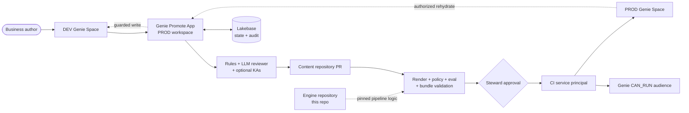

# Genie Promote

Genie Promote is a governed DEV-to-PROD delivery workflow for Databricks Genie Spaces.

Business authors keep working in the native Genie interface in a development workspace. When a
Space is ready, they use a Databricks App to review it and request promotion. The accelerator turns
that request into a versioned content change, runs deterministic and AI-assisted checks, waits for a
separate production approval, and deploys the Space with a dedicated service principal.

This repository contains the reusable application and pipeline engine. Promoted Genie definitions
and related artifacts live in a separate content repository, such as
[`genie-spaces-content`](https://github.com/malcolndandaro/genie-spaces-content).

> The committed `recebiveis` configuration is a working example, not a portable default. A new
> installation must replace the sample domain, identities, repositories, Space IDs, and endpoints.
> Follow [SETUP.md](SETUP.md); changing only `databricks.yml` is not sufficient.

## What it provides

- A PROD-hosted Databricks App with a FastAPI backend and Svelte frontend.
- Native Genie authoring in DEV and governed deployment to PROD.
- Deterministic environment, audience, and evaluation checks.
- An LLM reviewer with a protected response contract and editable reviewer persona.
- Optional Agent Bricks Knowledge Assistants for grounded, advisory findings.
- Pull-request history, required checks, and a protected production Environment.
- Durable Lakebase state for promotions, attempts, audit, roles, rules, prompts, and KAs.
- A guarded PROD-to-DEV rehydrate flow.

## Architecture



The two repositories have intentionally different responsibilities:

| Location | Owns |
|---|---|
| **Engine repository** | App code, reviewer, checks, render/deploy logic, tests, and `databricks.yml`. |
| **Content repository** | Serialized Spaces, titles, audiences, mappings, optional dashboards/setup data, `engine.lock`, and the promotion workflows. |
| **DEV workspace** | Human-authored Spaces, benchmark questions, DEV data, and live evaluations. |
| **PROD workspace** | The app, Lakebase, model endpoints, governed Spaces, and PROD data. |

Every content check and deployment resolves the exact engine commit recorded in `engine.lock`. An
engine change therefore reaches production only after a reviewed lock update in the content
repository when the protections in [SETUP.md](SETUP.md#12-configure-governance-controls) are
enabled.

## Promotion flow

1. An Author creates and tests a Genie Space in DEV.
2. The app verifies the caller and their live access to that Space.
3. The Author confirms the production title, table mapping, and required Genie audience.
4. Deterministic rules, the reviewer model, optional KAs, and the Genie evaluation run.
5. The GitHub App opens or updates a content PR.
6. The content repository renders DEV references for PROD and runs the required checks.
7. A human reviews the content change and a Steward releases the protected `prod` Environment.
8. The CI identity deploys the exact content/engine revision pair and verifies the live ACL.

The pipeline reconciles Genie `CAN_RUN` audience permissions. It does **not** grant Unity Catalog
data access; table grants remain owned by the customer's normal governance process.

## Roles and trust boundaries

| Actor | Responsibility |
|---|---|
| **Author** | Authors a DEV Space and requests promotion. |
| **Steward** | Reviews evidence and approves production deployment. |
| **Platform Admin** | Configures identities, roles, rules, endpoints, and operational access. |
| **App service principal** | Runs the app, connects to Lakebase, queries the reviewer, and reads governed Spaces. |
| **DEV transport SP** | Performs cross-workspace Genie calls after the app verifies the human caller's live ACL. |
| **Validation service principal** | Runs PROD-facing PR checks without deployment/admin authority. |
| **Deployment service principal** | Deploys behind the production gate, asserts app access, and reconciles Genie audience ACLs. |
| **GitHub App** | Creates content branches/PRs and reads checks and deployments. It never approves them. |

The forwarded on-behalf-of token identifies the human caller. It cannot be used as a
cross-workspace credential, so DEV operations use a transport service principal only after the app
performs a fail-closed per-user authorization check. See the
[authorization threat model](docs/security/assert-can-access-threat-model.md).

## Deployment assumptions

Read these before treating the accelerator as production-ready:

- The supported topology is two Databricks workspaces and two GitHub repositories.
- Databricks Apps user authorization must be enabled in PROD for the requested
  `dashboards.genie` scope.
- The current bundle uses the supported Lakebase `database_instances` compatibility path. New
  resources created through it are Autoscaling projects, but the runtime still uses the Database
  API. Do not attach an independently created Postgres-only project without migrating the runtime.
- The current workflows execute repository code on self-hosted runners with workspace credentials.
  Use private/trusted repositories or isolated ephemeral runners. Do not run arbitrary public-fork
  PR code on a persistent privileged runner.
- The sample uses the PROD workspace-admin deployment credential during PR validation. Production
  adopters should split validation onto a separate least-privilege identity; otherwise every actor
  who can run PR code is inside the PROD administrator trust boundary.
- The content workflows currently derive shell inputs from content filenames. Until that boundary
  is hardened, restrict content changes to trusted contributors.
- The engine-only bundle is a one-time bootstrap shape. After PROD content is managed, every full
  deploy must overlay the complete content repository; deploying an empty engine checkout can
  reconcile managed Spaces as deletions.
- No `LICENSE` file is included. Add an appropriate license before third-party redistribution.

The canonical, command-level deployment runbook is [SETUP.md](SETUP.md).

## Deployment at a glance

1. Create an engine repository and a content repository.
2. Choose a clean installation or intentionally retain the sample domain.
3. Replace every deployment-specific value in both repositories.
4. Prepare DEV/PROD catalogs, tables, warehouses, identities, and the reviewer endpoint.
5. Configure GitHub variables, secrets, runners, and the `prod` Environment.
6. Bootstrap the app and Lakebase once as the same CI identity used by later deployments.
7. Configure the app SP, DEV transport SP, and GitHub App.
8. Open one benchmarked DEV Space promotion, let both checks report once, enable branch protection
   before merging, then complete the gated deployment and record the evidence.

Do not start with a content push: the production deployment preflight expects the app to exist.
The one-time bootstrap in [SETUP.md](SETUP.md#8-bootstrap-the-control-plane-once) resolves that
dependency and keeps bundle state owned by the CI identity.

## Local validation

Local tests do not mutate Databricks or GitHub:

```bash
git clone https://github.com/malcolndandaro/genie-promote-cicd.git
cd genie-promote-cicd

python3 -m venv .venv
source .venv/bin/activate
python3 -m pip install -r requirements.txt pytest httpx
python3 -m pytest tests/ -q

(
  cd web
  npm ci
  npm run check
  npm run build
)
```

For browser tests:

```bash
(
  cd web
  npx playwright install chromium
  npm run test:smoke
)
```

The full readiness verifier also checks that the content repository pins the current engine HEAD:

```bash
python3 scripts/pilot_readiness.py \
  --content-repo /path/to/genie-spaces-content \
  --offline-only
```

A lock mismatch is an intentional `NO-GO`. Update `engine.lock` through a reviewed content PR; do
not silently bypass the check.

## Required GitHub checks

Content `main` must require these exact job names:

- `bundle validate (prod)`
- `eval-run pass-rate (dev)`

Before requiring them, remove the sample workflows' skip-on-missing-configuration conditions and
Markdown path filters so the checks always report. The exact hardening sequence is in
[SETUP.md](SETUP.md#content-branch-protection).

For a production installation, also require at least one pull-request approval and protect the
`prod` Environment with a Steward reviewer. GitHub's `prevent_self_review` prevents the workflow
initiator from approving that deployment; it does not by itself prove that the business requester
and Steward are different people. Keep that role assignment explicit and auditable.

## Repository tour

| Path | Purpose |
|---|---|
| `app/` | Promotion, authorization, rehydrate, rules, roles, KAs, and Lakebase stores. |
| `engine_api/` | FastAPI routes, OBO boundary, startup migrations, and reconciliation. |
| `web/` | Svelte application. |
| `genie_reviewer/` | Reviewer, policy, evaluation, audience, and GitHub App modules. |
| `scripts/` | Build, render, provision, validate, deploy, and verification tools. |
| `databricks.yml` | Databricks bundle for the PROD control plane and generated content resources. |
| `AGENTS.md` / `CLAUDE.md` | Architecture, ownership, safety, and verification rules for contributors and coding agents. |
| `docs/adr/` | Architectural decisions and trade-offs. |
| `docs/security/` | Authorization threat model. |
| `tests/` | Offline engine and API tests. |

## Further reading

- [Deployment and operations guide](SETUP.md)
- [Pilot GO/NO-GO checklist](docs/PILOT-GO-NO-GO.md)
- [ADR-0005: Lakebase state and audit](docs/adr/0005-lakebase-index-audit-over-github.md)
- [ADR-0006: PROD control plane and cross-workspace reach](docs/adr/0006-app-in-prod-cross-workspace-reach.md)
- [ADR-0007: safe, replayable production deployments](docs/adr/0007-safe-resumable-promotion-deploy.md)
- [Authorization threat model](docs/security/assert-can-access-threat-model.md)

## Contributing

Keep changes in the repository that owns them:

- Application, reviewer, policy, setup, or deployment logic → engine repository.
- Serialized Spaces, audiences, mappings, dashboards, and seed data → content repository.

Before opening an engine PR:

```bash
python3 -m pytest tests/ -q
bash scripts/render.sh prod
mkdir -p build/promote_app
databricks bundle validate --strict -t prod --var warehouse_id=<prod-warehouse-id> -p <prod-profile>

cd web
npm ci
npm run check
```
