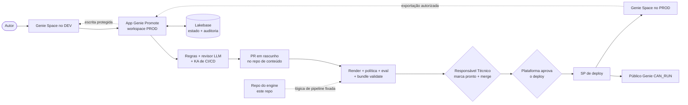

# Genie Promote

O Genie Promote é um fluxo governado de entrega DEV→PROD para Genie Spaces do Databricks.

O **Autor** continua trabalhando na interface nativa do Genie, em um workspace de desenvolvimento.
Quando um Genie Space está pronto, ele usa um Databricks App para revisá-lo e **preparar a
promoção**. O acelerador transforma esse pedido em uma mudança de conteúdo versionada, roda
checagens determinísticas e assistidas por IA, aguarda uma aprovação de produção separada e implanta
o Space com um service principal (SP) dedicado.

Este repositório é um **acelerador portável e reutilizável**: contém a aplicação e o engine do
pipeline (o "repositório do engine"). As definições de Genie promovidas e os artefatos relacionados
vivem em um repositório de conteúdo separado (por exemplo, `genie-spaces-content`).

> A configuração `recebiveis` versionada é um exemplo funcional, não um padrão portável. Uma nova
> instalação precisa substituir o domínio de exemplo, as identidades, os repositórios, os IDs de
> Space e os endpoints. Siga o [SETUP.md](SETUP.md); mudar apenas o `databricks.yml` não é
> suficiente.

## O que oferece

- Um Databricks App hospedado em PROD, com backend FastAPI e frontend Svelte.
- Autoria nativa no Genie em DEV e deploy governado para PROD.
- Checagens determinísticas de ambiente, público (audience) e avaliação (eval).
- Revisão automática por LLM (revisor), com contrato de resposta protegido e persona editável.
- Um Knowledge Assistant (KA) fixo — o handbook de CI/CD, global a todos os spaces — consultado pela
  revisão como fonte consultiva adicional (nunca bloqueante).
- Histórico de pull requests, checks obrigatórios e um Environment de produção protegido.
- Estado durável no Lakebase para promoções, tentativas, auditoria, papéis, regras e prompts.
- Um fluxo protegido de exportação Prod → Dev (rehydrate).

## Arquitetura



Os dois repositórios têm responsabilidades intencionalmente diferentes:

| Local | Responsável por |
|---|---|
| **Repositório do engine** | Código do app, revisor, checks, lógica de render/deploy, testes e `databricks.yml`. |
| **Repositório de conteúdo** | Spaces serializados, títulos, públicos (audiences), mapeamentos, dashboards/dados de setup opcionais, `engine.lock` e os workflows de promoção. |
| **Workspace DEV** | Spaces autorados por pessoas, perguntas de benchmark, dados de DEV e avaliações ao vivo. |
| **Workspace PROD** | O app, o Lakebase, endpoints de modelo, Spaces governados e dados de PROD. |

Toda checagem de conteúdo e todo deploy resolvem o commit exato do engine registrado em
`engine.lock`. Uma mudança no engine só chega à produção após uma atualização revisada do lock no
repositório de conteúdo, quando as proteções descritas no
[SETUP.md](SETUP.md#12-configurar-os-controles-de-governança--uma-vez-só) estiverem ativas.

## Fluxo de promoção

1. O Autor cria e testa um Genie Space no DEV.
2. O app verifica quem está chamando e o acesso ao vivo dessa pessoa ao Space.
3. O Autor confirma o título de produção, o mapeamento de tabelas (de-para) e o público (audience)
   Genie desejado — tudo opcional — e clica em **"Preparar promoção"**.
4. Rodam as regras determinísticas, o revisor (LLM), o KA de CI/CD e a avaliação (eval) do Genie. A
   revisão roda sempre do zero, a cada pedido — nunca é reaproveitada.
5. O GitHub App (bot) abre ou atualiza um **PR em rascunho** no repositório de conteúdo. O rascunho
   sempre é aberto — mesmo se a revisão encontrar um problema grave (BLOCKER), caso em que o PR
   recebe a etiqueta `revisao-pendente` e os achados aparecem no topo do comentário. O bot nunca
   marca o PR como pronto.
6. Os checks do CI rodam no rascunho (o "test drive" do Autor): render das referências DEV→PROD,
   testes, `bundle validate` e a checagem de público.
7. O **Responsável Técnico** revisa a mudança no GitHub, marca o PR como pronto (*mark as ready*) e
   faz o merge — esse é o ato de **promover**, sempre manual no GitHub. (Reenviar uma promoção cujo
   PR já estava pronto o rebaixa de volta para rascunho automaticamente.)
8. A **Plataforma** aprova o deploy no gate do Environment `prod` protegido.
9. A identidade de CI implanta o par exato de revisões (conteúdo + engine) e verifica a ACL ao vivo.

O pipeline reconcilia as permissões de público Genie `CAN_RUN`. Ele **não** concede acesso a dados no
Unity Catalog; os grants de tabela permanecem sob o processo normal de governança do cliente.

## Papéis e fronteiras de confiança

| Ator | Responsabilidade |
|---|---|
| **Autor** (qualquer usuário do app) | Autora um Space no DEV e prepara a promoção (abre o PR em rascunho). |
| **Responsável Técnico** (permissão `Write` no GitHub) | Revisa o rascunho, marca como pronto e faz o merge — o ato de promover. |
| **Plataforma** (required-reviewer do Environment `prod`) | Aprova o deploy de produção no gate do Environment. |
| **Administrador da Plataforma** (papel `admin` no app) | Único papel guardado pelo app; libera apenas o console de administração. Não decide promoções nem deploys. |
| **Service principal do app** | Roda o app, abre/rebaixa PRs em rascunho (nunca marca como pronto), conecta ao Lakebase, consulta o revisor e lê Spaces governados. |
| **SP de transporte do DEV** | Faz as chamadas Genie entre workspaces, somente após o app verificar a autorização por usuário (fail-closed). |
| **SP de validação** | Roda os checks de PR voltados a PROD, sem autoridade de deploy ou de admin. |
| **SP de deploy** | Implanta atrás do gate de produção, assegura o acesso do app e reconcilia as ACLs de público Genie. |
| **GitHub App (bot)** | Cria branches/PRs de conteúdo e lê checks e deployments. Nunca os aprova nem marca um PR como pronto. |

A separação de funções (SoD) é imposta **inteiramente pelo GitHub**: a permissão `Write` define quem
faz o merge (Responsável Técnico) e o required-reviewer do Environment define quem aprova o deploy
(Plataforma). O app não decide nada disso — guarda apenas o bit `admin`.

O token *on-behalf-of* encaminhado identifica quem está chamando. Ele não pode ser usado como
credencial entre workspaces, então as operações no DEV usam um service principal de transporte apenas
depois de o app fazer uma verificação de autorização por usuário fail-closed. Veja o
[modelo de ameaças de autorização](docs/security/assert-can-access-threat-model.md).

## Premissas de deploy

Leia isto antes de tratar o acelerador como pronto para produção:

- A topologia suportada é de dois workspaces Databricks e dois repositórios GitHub.
- A autorização de usuário do Databricks Apps precisa estar habilitada em PROD para o escopo
  `dashboards.genie` solicitado.
- O bundle atual usa o caminho de compatibilidade suportado do Lakebase (`database_instances`).
  Novos recursos criados por ele são projetos Autoscaling, mas o runtime ainda usa a Database API.
  Não anexe um projeto Postgres-only criado à parte sem migrar o runtime.
- Os workflows atuais executam código do repositório em runners self-hosted com credenciais do
  workspace. Use repositórios privados/confiáveis ou runners efêmeros isolados. Não rode código de PR
  de forks públicos arbitrários em um runner privilegiado persistente.
- O exemplo usa a credencial de deploy (workspace admin de PROD) durante a validação de PR.
  Instalações de produção devem separar a validação em uma identidade de menor privilégio; caso
  contrário, todo ator capaz de rodar código de PR estará dentro da fronteira de confiança de
  administrador de PROD.
- Os workflows de conteúdo hoje derivam entradas de shell a partir de nomes de arquivos de conteúdo.
  Até esse limite ser endurecido, restrinja mudanças de conteúdo a contribuidores confiáveis.
- O bundle só-engine é um formato de bootstrap único. Depois que o conteúdo de PROD passa a ser
  gerenciado, todo deploy completo precisa sobrepor o repositório de conteúdo completo; implantar um
  checkout de engine vazio pode reconciliar Spaces gerenciados como exclusões.
- Não há arquivo `LICENSE`. Adicione uma licença apropriada antes de qualquer redistribuição a
  terceiros.

O runbook canônico de deploy, no nível de comando, é o [SETUP.md](SETUP.md).

## Deploy num relance

1. Crie um repositório do engine e um repositório de conteúdo.
2. Escolha uma instalação limpa ou retenha o domínio de exemplo de propósito.
3. Substitua todo valor específico de instalação nos dois repositórios.
4. Prepare catálogos, tabelas, warehouses, identidades e o endpoint do revisor em DEV/PROD.
5. Configure as variáveis, secrets, runners e o Environment `prod` no GitHub.
6. Faça o bootstrap do app e do Lakebase uma vez, com a mesma identidade de CI usada nos deploys
   posteriores.
7. Configure o SP do app, o SP de transporte do DEV e o GitHub App.
8. Abra uma promoção de um Space DEV com benchmark, deixe os dois checks reportarem uma vez, habilite
   a proteção de branch antes do merge e conclua o deploy com gate, registrando as evidências.

Não comece por um push de conteúdo: o preflight do deploy de produção espera que o app já exista. O
bootstrap único no [SETUP.md](SETUP.md#8-fazer-o-bootstrap-do-plano-de-controle--uma-vez-só) resolve essa dependência e
mantém o estado do bundle sob a identidade de CI.

## Validação local

Os testes locais não alteram o Databricks nem o GitHub:

```bash
git clone https://github.com/malcolndandaro/genie-promote-cicd.git
cd genie-promote-cicd

python3 -m venv .venv
source .venv/bin/activate
python3 -m pip install -r requirements.txt pytest httpx
python3 -m pytest tests/ -q

(
  cd web
  npm ci
  npm run check
  npm run build
)
```

Para testes de navegador:

```bash
(
  cd web
  npx playwright install chromium
  npm run test:smoke
)
```

O verificador completo de prontidão também confere se o repositório de conteúdo fixa o HEAD atual do
engine:

```bash
python3 scripts/pilot_readiness.py \
  --content-repo /caminho/para/genie-spaces-content \
  --offline-only
```

Uma divergência de lock é um `NO-GO` intencional. Atualize o `engine.lock` por um PR de conteúdo
revisado; não contorne a checagem silenciosamente.

## Checks obrigatórios do GitHub

O `main` do repositório de conteúdo deve exigir estes nomes exatos de job:

- `bundle validate (prod)`
- `eval-run pass-rate (dev)`

Antes de exigi-los, remova dos workflows de exemplo as condições de "pular quando não configurado" e
os filtros de path de Markdown, para que os checks sempre reportem. A sequência exata de hardening
está no [SETUP.md](SETUP.md#branch-protection-do-conteúdo).

Em uma instalação de produção, exija também pelo menos uma aprovação de pull request e proteja o
Environment `prod` com um revisor da **Plataforma**. O `prevent_self_review` do GitHub impede que
quem iniciou o workflow aprove aquele deploy; por si só, ele não prova que o solicitante de negócio e
a Plataforma são pessoas diferentes. Mantenha essa atribuição de papéis explícita e auditável.

## Tour do repositório

| Caminho | Propósito |
|---|---|
| `app/` | Promoção, autorização, rehydrate, regras, papéis, prompts e stores do Lakebase. |
| `engine_api/` | Rotas FastAPI, fronteira OBO, migrações de startup e reconciliação. |
| `web/` | Aplicação Svelte. |
| `genie_reviewer/` | Revisor, política, avaliação, público (audience) e módulos do GitHub App. |
| `scripts/` | Ferramentas de build, render, provisionamento, validação, deploy e verificação. |
| `databricks.yml` | Bundle Databricks para o control plane de PROD e os recursos de conteúdo gerados. |
| `AGENTS.md` / `CLAUDE.md` | Arquitetura, ownership, segurança e regras de verificação para contribuidores e agentes de código. |
| `docs/adr/` | Decisões arquiteturais e trade-offs. |
| `docs/security/` | Modelo de ameaças de autorização. |
| `tests/` | Testes offline do engine e da API. |

## Leitura adicional

- [Guia de deploy e operação](SETUP.md)
- [Checklist de GO/NO-GO do piloto](docs/PILOT-GO-NO-GO.md)
- [ADR-0005: estado e auditoria no Lakebase](docs/adr/0005-lakebase-index-audit-over-github.md)
- [ADR-0006: control plane em PROD e alcance entre workspaces](docs/adr/0006-app-in-prod-cross-workspace-reach.md)
- [ADR-0007: deploys de produção seguros e re-executáveis](docs/adr/0007-safe-resumable-promotion-deploy.md)
- [ADR-0008: GitHub como módulo profundo com domínio neutro em relação ao provedor](docs/adr/0008-github-deep-module-with-provider-neutral-domain.md)
- [ADR-0009: aposentadoria do modelo de acesso de demonstração (expand-switch-contract)](docs/adr/0009-retire-access-model-expand-switch-contract.md)
- [Modelo de ameaças de autorização](docs/security/assert-can-access-threat-model.md)

## Contribuindo

Mantenha cada mudança no repositório que a possui:

- Lógica de aplicação, revisor, política, setup ou deploy → repositório do engine.
- Spaces serializados, públicos (audiences), mapeamentos, dashboards e dados de seed → repositório de
  conteúdo.

Antes de abrir um PR no engine:

```bash
python3 -m pytest tests/ -q
bash scripts/render.sh prod
mkdir -p build/promote_app
databricks bundle validate --strict -t prod --var warehouse_id=<prod-warehouse-id> -p <prod-profile>

cd web
npm ci
npm run check
```
