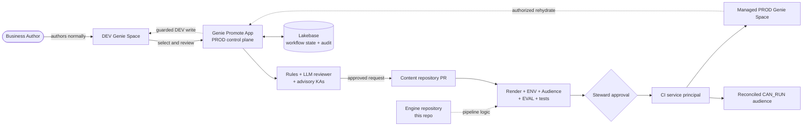

# Genie Promote

Governed promotion for Databricks Genie Spaces—without asking business users to learn Git, CI/CD,
or the Databricks CLI.

Business teams continue authoring in native Genie in a development workspace. When a Space is ready,
they use one Databricks App to review it, request promotion, follow the approval, and see the production
result. Behind the scenes, every production change is represented by a pull request, checked by policy
and evaluation gates, approved by a separate Steward, and deployed by a dedicated service principal.

This repository is the reusable **application and pipeline engine**. Promotable Genie and dashboard
content lives in a separate content repository, such as
[`genie-spaces-content`](https://github.com/malcolndandaro/genie-spaces-content).

> The included `recebiveis` domain is a working example. Replace it with your own domain, identities,
> workspaces, repositories, and Knowledge Assistants during setup.

## What you get

- A Databricks App with a FastAPI backend and Svelte interface.
- Native DEV Genie authoring with guided promotion to PROD.
- Fresh LLM review plus deterministic environment, audience, and evaluation checks.
- Optional Agent Bricks Knowledge Assistants for grounded, advisory feedback.
- GitHub pull requests, required checks, and a human production approval gate.
- Required Genie audience (`CAN_RUN`) reconciled safely by the deployment pipeline.
- A controlled PROD → DEV rehydrate flow.
- Durable Lakebase state for promotions, deployment attempts, audit, roles, rules, prompts, and KAs.
- Focused experiences for Authors, Stewards, and Platform Admins.

## How it works



The user journey is deliberately simple:

1. **Author in DEV.** A business user creates and tests a Genie Space in the native Databricks UI.
2. **Prepare the promotion.** In the app, the user selects the Space and can adjust its production
   title, table mapping, and required Público do Space.
3. **Review before creating a PR.** The app verifies the caller, checks their live Space access,
   runs deterministic rules, invokes the reviewer model, consults any in-scope Knowledge Assistants,
   and runs the configured Genie evaluation.
4. **Create a reviewed change.** A GitHub App writes the serialized Space and its sidecars to a
   per-Space branch in the content repository and opens or updates a pull request.
5. **Run authoritative gates.** GitHub Actions renders DEV references for PROD, rejects foreign
   catalogs, validates the audience and benchmarks, re-runs the DEV evaluation, and validates the bundle.
6. **Separate approval from deployment.** A Steward approves the protected PROD Environment. A
   dedicated CI service principal then deploys the Space and reconciles its declared audience.
7. **Keep the full history.** The app reflects GitHub status and stores workflow history and audit
   facts in Lakebase. Authorized users can also rehydrate a PROD Space back into DEV.

## What lives where

| Area | Responsibility |
|---|---|
| **DEV workspace** | Native Genie authoring, benchmark questions, development data, and DEV evaluations. |
| **PROD workspace** | The Databricks App, Lakebase, reviewer endpoints, managed PROD Spaces, and production data. |
| **Engine repository** | This repository: app code, reviewer, policy checks, render logic, tests, and DABs configuration. |
| **Content repository** | Serialized Genie Spaces, titles, audiences, mappings, revision manifests, and promotion workflows. |
| **GitHub App** | Creates branches and PRs, posts review comments, and reads check/deployment status. It never approves. |
| **Self-hosted runners** | Execute validation and deployment where workspace IP access policies require an allowlisted host. |

## Roles and identities

The security model is easier to understand when humans and machine identities are kept separate.

| Actor | What it does |
|---|---|
| **Author** | Authors a DEV Space and requests promotion. Needs `CAN_USE` on the app and access to their DEV Space. |
| **Steward** | Reviews evidence and approves the GitHub PROD Environment. Cannot self-approve their own request. |
| **Platform Admin** | Configures roles, rules, Knowledge Assistants, and operational access. |
| **App service principal** | Runs the PROD-hosted app, queries reviewer endpoints, reads PROD state, and connects to Lakebase. |
| **DEV reader/writer SP** | Transports cross-workspace Genie calls. Every call is gated against the verified human's live ACL. |
| **CI service principal** | Validates and deploys the bundle, reconciles audience ACLs, and gives the app technical access to deployed Spaces. |

The forwarded OBO token proves **who the caller is**. It is not used as a cross-workspace transport.
For DEV operations, the app compares the platform-verified user and groups with the target Space's
live ACL, fails closed on any error, and only then uses the DEV service principal. See the
[threat model](docs/security/assert-can-access-threat-model.md) for the detailed reasoning.

## Try it locally

Local validation does not require a live Databricks workspace:

```bash
git clone https://github.com/malcolndandaro/genie-promote-cicd.git
cd genie-promote-cicd

python3 -m venv .venv
source .venv/bin/activate
python3 -m pip install -r requirements.txt pytest
python3 -m pytest tests/ -q

cd web
npm ci
npm run check
npm run build
```

This validates the Python engine, API contracts, Svelte types, and production frontend build. Live
workspace, GitHub, model-serving, and Lakebase operations are intentionally exercised only after the
deployment prerequisites below are configured.

For the complete pre-pilot proof (backend, frontend, Playwright, both repository render shapes,
contract/migration checks and a redacted evidence manifest), run:

```bash
python3 scripts/pilot_readiness.py \
  --content-repo /path/to/genie-spaces-content \
  --offline-only
```

Offline success is not a live GO. Copy [the evidence template](docs/pilot-live-evidence.example.json)
and re-run without `--offline-only`; missing provider/human evidence returns `NO-GO` without mutating
Databricks or GitHub. The human decision remains the [R1–R15 checklist](docs/PILOT-GO-NO-GO.md).

## Guided deployment

The setup is easiest when completed in order. Finish the verification under each step before moving
to the next one.

### Before you begin

Collect these values first:

| Value | Example |
|---|---|
| Engine repository | `your-org/genie-promote-cicd` |
| Content repository | `your-org/genie-spaces-content` |
| DEV / PROD CLI profiles | `customer-dev` / `customer-prod` |
| DEV / PROD workspace URLs | `https://...cloud.databricks.com` |
| DEV / PROD SQL warehouse IDs | one warehouse in each workspace |
| Domain and catalogs | `sales`, `dev_sales`, `prod_sales` |
| Initial Space audience | one or more users/groups that should receive Genie `CAN_RUN` |
| Steward | a Databricks email and a distinct GitHub login |
| Author group | the group that receives `CAN_USE` on the app |

You also need:

- Databricks CLI `1.4.0` with authenticated DEV and PROD profiles.
- Workspace/account administration rights for initial identity and permission setup.
- GitHub CLI access to both repositories.
- A self-hosted runner registered to each repository. The supplied workflows use
  `runs-on: self-hosted`.

### Step 1 — Create the two repositories

Fork or copy both repositories into the GitHub owner that will operate the accelerator:

- **Engine:** `genie-promote-cicd`
- **Content:** `genie-spaces-content`

In both content-repository workflows, set `APP_REPO` to your engine repository. The app's
`APP_GH_REPO` must point to your content repository.

**Done when:** the content workflow can check out the engine repository.

### Step 2 — Replace the sample configuration

Start with the smallest configuration and add optional features later.

| File | Values to review |
|---|---|
| `databricks.yml` | `domain`, `dev_host`, `dev_warehouse_id`, and Lakebase names. |
| `scripts/provision_ci.sh` | PROD profile/host, CI SP name, PROD catalog, warehouse, and GitHub repository. |
| `scripts/build_promote_app.sh` | Steward/Admin emails, content repo, domain, slug map, and optional KA seed. |
| Content `.github/workflows/*.yml` | `APP_REPO` and any pinned `APP_SPACE_SLUGS`. |

For a first deployment, use an empty slug map and no Knowledge Assistants:

```text
APP_SPACE_SLUGS={}
APP_KA_SEED=[]
```

**Done when:** `rg 'malcolndandaro|cerc|recebiveis|01f[0-9a-f]+'` returns only examples you
intentionally kept.

### Step 3 — Prepare DEV and PROD

1. Create `dev_<domain>` and `prod_<domain>` catalogs with managed storage.
2. Create or select one SQL warehouse in each workspace.
3. Confirm both CLI profiles can reach their workspace.

```bash
databricks current-user me -p <dev-profile>
databricks current-user me -p <prod-profile>
```

**Done when:** both commands return the expected operator and both catalogs are visible.

### Step 4 — Provision the PROD CI identity and GitHub variables

After editing the configuration block in `scripts/provision_ci.sh`, run it for both repositories:

```bash
PROD_WAREHOUSE_ID=<prod-warehouse-id> STEWARD_GH=<steward-login> \
  GH_REPO=<owner>/genie-promote-cicd bash scripts/provision_ci.sh

PROD_WAREHOUSE_ID=<prod-warehouse-id> STEWARD_GH=<steward-login> \
  GH_REPO=<owner>/genie-spaces-content bash scripts/provision_ci.sh
```

The script creates or reuses the CI service principal, grants its PROD catalog and warehouse access,
sets GitHub variables/secrets, and configures the `prod` Environment reviewer.

Set these DEV values on both repositories as well:

```text
DATABRICKS_DEV_HOST
DATABRICKS_DEV_WAREHOUSE_ID
```

**Done when:** both repositories contain the five workspace variables and
`DATABRICKS_PROD_SP_SECRET`; the content repository's `prod` Environment has a required reviewer and
prevents self-review.

> The CI identity currently needs PROD workspace-admin membership for the Databricks App ↔ Lakebase
> binding, plus Unity Catalog `MANAGE` to grant access to other principals. Treat it as a deployment
> identity and monitor it accordingly.

### Step 5 — Register the runners and protect the content branch

Register one self-hosted runner to each repository. The runner must be able to reach both Databricks
workspace APIs.

Protect the content repository's `main` branch with these required checks:

```text
bundle validate (prod)
eval-run pass-rate (dev)
```

Enable strict checks and enforce them for administrators. Separation of duties is enforced by the
content repository's protected `prod` Environment.

**Done when:** both runners are online and a test content PR waits for both checks.

### Step 6 — Deploy the PROD control plane

Merge or push a harmless change to the content repository's `main` branch. Its deployment workflow
checks out this engine, overlays the content, renders the bundle, builds the app, and pauses at the
`prod` Environment.

Approve the Environment deployment as the Steward. The first run creates:

- the PROD Databricks App;
- the Lakebase instance and app binding;
- any content currently present in the content repository.

**Done when:** `genie-promote-app` is running and Lakebase reports `AVAILABLE`.

### Step 7 — Provision cross-workspace DEV access

Run the self-healing DEV bootstrap from the engine repository:

```bash
DEV_PROFILE=<dev-profile> \
DEV_CATALOG=dev_<domain> \
DEV_WAREHOUSE_ID=<dev-warehouse-id> \
DEV_SPACE_IDS=<comma-separated-existing-space-ids> \
  bash scripts/provision_dev_sp.sh
```

Then complete the credential hand-off:

1. Copy `dev_sp_client_id` and `dev_sp_client_secret` from the DEV `genie_promote` secret scope to
   the scope with the same name in PROD.
2. Grant the app service principal `READ` on the PROD scope.
3. Set `DATABRICKS_DEV_SP_CLIENT_ID` and `DATABRICKS_DEV_SP_SECRET` on the content repository for the
   live evaluation job.

The exact secret-copy commands are in [SETUP.md](SETUP.md#dev-readerwriter-sp--bootstrap--secret-replication-a2-adr-0006).
Re-run the bootstrap after a DEV workspace reset or when a new existing Space must be added.

**Done when:** the app lists only DEV Spaces the signed-in user can access, and the content
repository's DEV evaluation job authenticates successfully.

### Step 8 — Connect the GitHub App

Create a GitHub App with repository access to the **content repository**:

- Contents: read/write
- Pull requests: read/write
- Issues: read/write
- Actions and Deployments: read

Generate a private key, install the App on the content repository, then run:

```bash
scripts/provision_github_app_secrets.sh \
  <github-app-id> <path-to-private-key.pem> <prod-profile> <owner>/genie-spaces-content
```

The helper discovers the installation ID, writes the three credentials to the PROD secret scope,
grants the current app SP access, and verifies that an installation token can be minted.

**Done when:** the helper's final verification succeeds and the app can open a test promotion PR.

### Step 9 — Grant application access

Resolve the app service principal, then grant it:

- `CAN_USE` on the PROD SQL warehouse;
- `USE_CATALOG` and `USE_SCHEMA` on `prod_<domain>`;
- `CAN_QUERY` on any configured Knowledge Assistant endpoints.

```bash
APP_SP=$(databricks apps get genie-promote-app -p <prod-profile> -o json \
  | python3 -c 'import json,sys; print(json.load(sys.stdin)["service_principal_client_id"])')

databricks warehouses update-permissions <prod-warehouse-id> -p <prod-profile> --json \
  "{\"access_control_list\":[{\"service_principal_name\":\"$APP_SP\",\"permission_level\":\"CAN_USE\"}]}"

databricks grants update catalog prod_<domain> -p <prod-profile> --json \
  "{\"changes\":[{\"principal\":\"$APP_SP\",\"add\":[\"USE_CATALOG\",\"USE_SCHEMA\"]}]}"
```

Grant the author group permission to use the App:

```bash
databricks apps update-permissions genie-promote-app -p <prod-profile> --json \
  '{"access_control_list":[{"group_name":"<authors-group>","permission_level":"CAN_USE"}]}'
```

The deployment pipeline grants the app SP `CAN_MANAGE` on each deployed PROD Genie Space.

**Done when:** an Author can open the app, see their DEV Spaces, run a review, and request a
promotion without direct PROD catalog access.

### Step 10 — Run one end-to-end promotion

Use a DEV Space with at least two benchmark questions:

1. Request promotion in the app.
2. Confirm the content PR contains the serialized Space and expected sidecars.
3. Confirm both required checks pass.
4. Merge the PR and approve the PROD Environment deployment.
5. Confirm the PROD Space exists, the audience was reconciled, and the app shows the completed audit
   timeline.

Your installation is ready when that flow succeeds without using a human token for deployment.

### Reset disposable demo history

Before the pilot, KIP can clear promotion/review/deployment/rehydrate history while preserving
roles, rules, reviewer prompt and Knowledge Assistant configuration. The command is dry-run first:

```bash
python3 scripts/reset_demo_ledger.py --profile <prod-profile>
python3 scripts/reset_demo_ledger.py --profile <prod-profile> \
  --execute --confirm DELETE-DEMO-LEDGER
```

Run it only in the demo installation. It prints row counts before deletion and verifies the ledger
is empty afterward.

## Quality and governance model

| Control | Behavior |
|---|---|
| **ENV-01** | Blocks references outside the target environment/domain allowlist. |
| **AUDIENCE-01** | Blocks invalid principals/tables; missing `SELECT` is advisory and points to CERC's Terraform process. |
| **EVAL-01** | Requires a configurable minimum number of benchmark questions. |
| **Live eval-run** | Re-runs DEV benchmarks and blocks the content PR below the configured pass-rate. |
| **LLM reviewer** | Produces structured findings from a protected prompt core and editable reviewer persona. |
| **Knowledge Assistants** | Add grounded, cited advice. They are advisory-only and cannot block promotion. |
| **PROD Environment** | Requires a distinct human approval before the deployment identity can mutate PROD. |

## Repository tour

| Path | Purpose |
|---|---|
| `engine_api/` | FastAPI routes, OBO boundary, startup migrations, and scheduled reconciliation. |
| `web/` | Svelte application and persona-aware user experience. |
| `app/` | Promotion, authorization, rehydrate, roles, rules, prompts, KAs, audit, and Lakebase stores. |
| `genie_reviewer/` | Reviewer prompt, rules, evaluation, audience checks, GitHub App client, and MLflow agent wrapper. |
| `scripts/` | Render, validate, build, provision, deploy, and post-deploy access helpers. |
| `databricks.yml` | Portable DABs targets for the PROD control plane and DEV setup job. |
| `docs/adr/` | Architectural decisions and trade-offs. |
| `docs/security/` | Authorization threat model. |
| `tests/` | Offline engine and API tests. |

## Deeper reading

- [Detailed operator notes](SETUP.md)
- [ADR-0001: GitHub Actions as the CI engine](docs/adr/0001-github-actions-as-ci-engine.md)
- [ADR-0003: pre-rendering serialized Genie Spaces](docs/adr/0003-prerender-serialized-space.md)
- [ADR-0004: portable by construction](docs/adr/0004-portable-by-construction.md)
- [ADR-0005: Lakebase state and audit](docs/adr/0005-lakebase-index-audit-over-github.md)
- [ADR-0006: PROD-hosted control plane and cross-workspace reach](docs/adr/0006-app-in-prod-cross-workspace-reach.md)
- [Authorization threat model](docs/security/assert-can-access-threat-model.md)

## Contributing

Keep changes in the repository that owns them:

- Application, reviewer, policy, setup, or pipeline logic → this engine repository.
- Serialized Genie Spaces, dashboards, seed data, and promotion workflows → the content repository.

Before opening a PR:

```bash
python3 -m pytest tests/ -q
bash scripts/render.sh prod
mkdir -p build/promote_app
databricks bundle validate -t prod --var warehouse_id=<prod-warehouse-id>

cd web
npm ci
npm run check
```

The engine repository's CI validates engine deployability. Promotion gates and governed deployment
run in the content repository.
