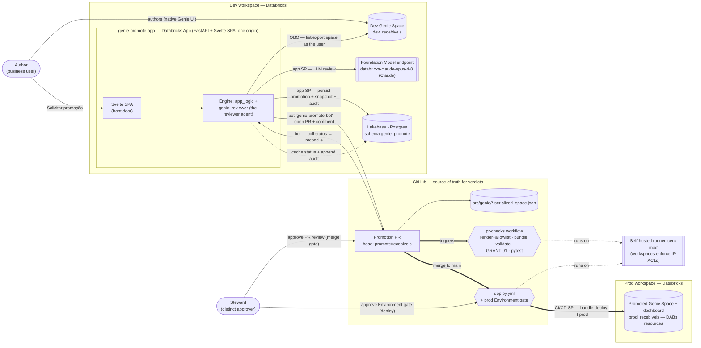
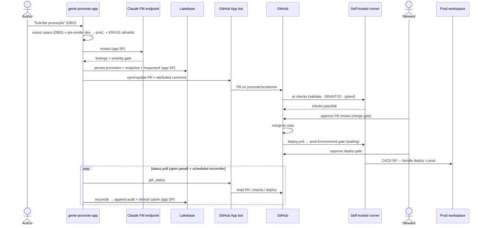

# genie-promote — promote Databricks Genie Spaces & AI/BI dashboards via reviewed CI/CD

A reference accelerator that lets a **business user author a Genie Space in a dev workspace and
promote it to a prod workspace** through a governed CI/CD flow — with an **LLM reviewer agent**,
deterministic governance checks, an eval-run quality gate, **separation of duties**, and a durable
**audit trail** — all from a **single FastAPI + Svelte app** that acts on the user's behalf (OBO), so
non-technical users never touch Git or the CLI.

Sample domain: `recebiveis` (Brazilian *receivables*) — swap it for your own (nothing is hardcoded).

---

## Architecture at a glance

### Who acts as what (identities & auth)

Every action runs as a **specific identity** — this is the security model, not just plumbing.

| Identity | Used for | How it authenticates |
|---|---|---|
| **Signed-in user (OBO)** | Listing + exporting *their* Genie spaces (respects their own data access) | `x-forwarded-access-token` injected by the Databricks Apps proxy, read **in-process** |
| **App service principal** | The **LLM reviewer**, the prod-grant preview, the **GitHub bot** (reads the secret scope), **Lakebase writes** | App SP env auto-injected by the platform; Lakebase via short-lived **OAuth** (no static password) |
| **GitHub App bot** (`genie-promote-bot`) | Opens/updates the promotion PR, posts the attributed review comment, reads PR/CI/deploy status | App JWT → installation token; creds in Databricks secret scope `genie_promote` (app SP has READ). **Never approves.** |
| **Steward** (a *distinct* human) | Approves the **PR review** (merge gate) **and** the **deploy Environment gate** — on GitHub, with their own identity | GitHub; `prevent_self_review` enforces requester ≠ approver |
| **CI/CD service principal (prod)** | `bundle validate` + GRANT-01 in `pr-checks`, and `bundle deploy -t prod` on merge | OAuth M2M in the GitHub workflows |

### What's stored where

GitHub is the **source of truth for verdicts**; Lakebase is a durable **index + audit log + status
cache** over it (it never overrides a live GitHub read; ADR-0005).

| GitHub (authoritative) | Lakebase / Postgres (index · audit · cache) |
|---|---|
| The promoted artifact: `src/genie/*.serialized_space.json` (+ dashboard `.lvdash.json`), versioned | `promotions` — one row per PR (1:1): resource, requester, PR #, branch, `current_phase`, cached `live_status`, `terminal` |
| The **PR**, its **checks**, the **PR-review** decision (merge gate) | `review_snapshots` — the reviewer's findings/gate/eval/timeline **at request time** (so recovery never re-runs the LLM) |
| The **merge**, the **deploy run**, the **prod Environment gate** + who released it | `audit_events` — append-only, **GitHub-attributed** trail (requested → pr_opened → pr_review_approved → merged → deploy_approved → deployed/failed) |

---

## The promotion lifecycle (end to end)

1. **Author** requests a promotion in the app. The app exports the space **as the user (OBO)**,
   pre-renders `dev_<domain>` → `prod_<domain>`, and runs the deterministic **ENV-01** allowlist.
2. The **reviewer agent** (LLM) scores it against the handbook; **GRANT-01** (missing UC grant) and
   **EVAL-01** (too few benchmark questions) are deterministic and own the gate verdict.
3. The **bot** opens a real PR editing `src/genie/...` and posts the attributed review comment; the
   app **persists** the promotion + snapshot + `requested` audit event to Lakebase.
4. `pr-checks` runs on the **self-hosted runner** (the prod SP re-runs GRANT-01 + `bundle validate`).
5. The **Steward** approves the PR review (merge), then approves the **prod Environment gate**
   (deploy) — two gates, distinct from the requester (`prevent_self_review`).
6. On merge, `deploy.yml` deploys the Genie Space + dashboard to prod as **DABs resources** via the
   **CI/CD SP**.
7. Throughout, the app **reconciles** live GitHub state into the Lakebase **audit trail + status
   cache** — on every status read *and* via a scheduled reconciler, so the record is complete even
   when no one is watching.

> The pipeline rebinds `dev_<domain>` → `prod_<domain>` at deploy because DABs `${var}` doesn't reach
> inside the serialized space (see `docs/adr/0003`). Catalogs are workspace-isolated per environment.

## Where the reviewer agent runs

**On Databricks — nothing leaves the platform.** The reviewer (`genie_reviewer/`) executes **inside
the `genie-promote-app` Databricks App**, authenticating as the **app service principal**, and the
LLM inference runs on a **Databricks Foundation Model serving endpoint** (`databricks-claude-opus-4-8`,
Claude — configurable via `APP_LLM_ENDPOINT`). A standalone **MLflow `ResponsesAgent`**
(`genie_reviewer/agent.py`) packages the same reviewer for independent Model Serving deployment. The
**deterministic** governance checks (ENV-01 / GRANT-01 / eval-run) are re-run **authoritatively in
CI** on the runner as the prod SP, so a soft or omitted LLM answer can never flip a broken space to
"pass".

---

## Layout

| Path | What |
|---|---|
| `databricks.yml` | DABs bundle: dev/prod targets, the prod-only `genie_spaces` + `dashboards` resources, the dev-only **Lakebase** instance + app binding (ADR-0005) |
| `genie_reviewer/` | the reviewer agent — `review_core`, `handbook_rules`, `grant_check`, `eval_gate`, `fix_core`, `agent` (MLflow), `github_app` (the bot), `promotion_comment` |
| `app/` | `app_logic.py` (shared engine: OBO/SP `_client`, review, request_promotion, status), `promotion_store.py` (Lakebase store), `reconcile.py` (GitHub→audit) |
| `engine_api/` | the FastAPI app: JSON API (`/api/*`, OBO in-process) + serves the built Svelte SPA + the Lakebase startup migration + the scheduled reconciler |
| `web/` | Svelte 5 + Vite SPA — Meus Espaços / Revisão pipeline / Minhas promoções (history + audit) / Steward SoD |
| `scripts/` | `pre_render.py`, `render.sh`, `build_promote_app.sh`, `deploy_dev.sh`, `provision_ci.sh`, `verify_*.py` (incl. `verify_lakebase*.py`), `check_grants.py` |
| `resources/`, `src/` | DABs resources, setup/seed job, the serialized_space + dashboard artifacts |
| `.github/workflows/` | `pr-checks.yml` (validate + GRANT-01 + tests on every PR) · `deploy.yml` (merge → prod, behind the Environment gate) |
| `tests/` | offline unit tests (engine, store, reconcile, github bot, engine API; no live workspace/DB) |
| `docs/adr/` | architecture decisions (incl. ADR-0005: Lakebase as index/audit over GitHub-as-truth) |

## Durable state (Lakebase)

Promotions, review snapshots, and an append-only **audit trail** live in **Lakebase (Databricks
Postgres)** — a durable index + audit log + status cache over GitHub-as-truth (it never overrides a
live read; **reflect, never assert**). It is a **hard dependency** of the app (fails fast at startup
if misconfigured), provisioned all-DABs (dev target), config-driven (`lakebase_*` vars +
`APP_LAKEBASE_SCHEMA`), and the app connects as its **SP via short-lived OAuth** — no static
password. A reload **recovers** a promotion from its stored snapshot **without re-running the LLM**.
See `SETUP.md` → *Lakebase* for the config knobs, the connectivity smoke, and the scheduled-reconciler
design.

## Use it on your workspaces

1. **Set your workspaces** — `DATABRICKS_HOST` (env) or a CLI profile per target; `warehouse_id` is a
   DABs var (CI injects it via repo variables). Nothing else is workspace-pinned (ADR-0004).
2. **Pre-create the domain catalogs** `dev_<domain>` / `prod_<domain>` (UI → Default Storage).
3. **Go live (CI)** — see `SETUP.md`: `scripts/provision_ci.sh` (CI/CD SP + OAuth secret + repo vars +
   prod Environment), the GitHub App bot, the Lakebase resource, and a **self-hosted runner**
   (workspaces with IP access lists reject GitHub-hosted runners).
4. **Run the tests** — `python3 -m pytest tests/ -q`.

## Notes
- The reviewer runs on a Databricks Foundation Model endpoint (Claude). Findings are in Portuguese (configurable).
- Deterministic findings (GRANT-01, EVAL-01) own their gate verdict — the agent removes typing, not judgment.
- Identities are config-driven (no hardcoded customer bindings); `recebiveis` is a *sample* domain.
