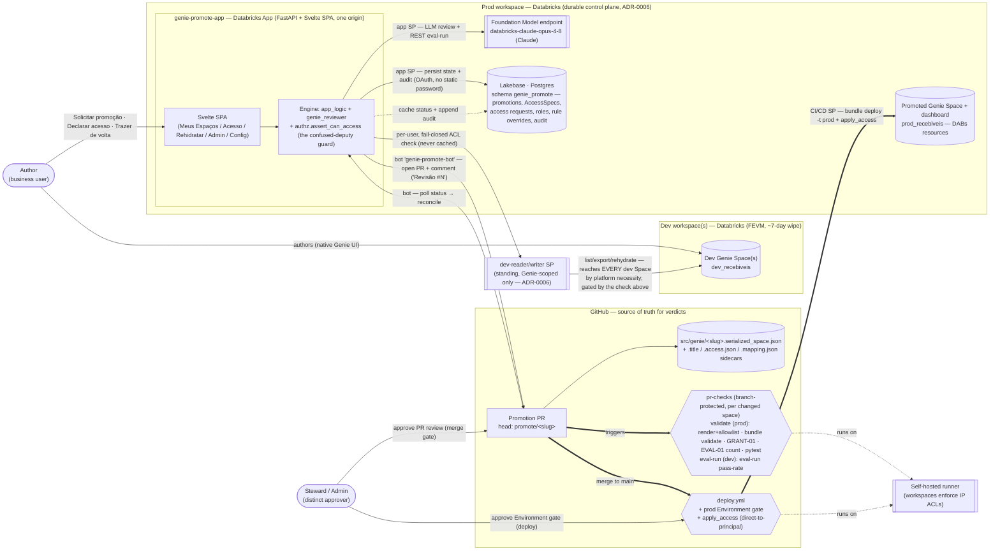
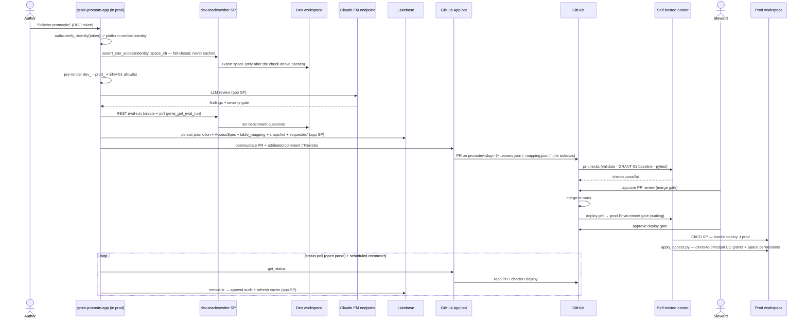

# genie-promote — promote Databricks Genie Spaces & AI/BI dashboards via reviewed CI/CD

A reference accelerator that lets a **business user author a Genie Space in a dev workspace and
promote it to a prod workspace** through a governed CI/CD flow — with an **LLM reviewer agent**,
deterministic governance checks, a real eval-run quality gate, **separation of duties**, self-service
**access requests**, a **rehydrate** path back to dev, and a durable **audit trail** — all from a
**single FastAPI + Svelte app**, itself hosted in the **prod workspace** as a durable control plane
(ADR-0006), that acts on the user's own verified identity for every dev-touching action so
non-technical users never touch Git or the CLI.

Sample domain: `recebiveis` (Brazilian *receivables*) — swap it for your own (nothing is hardcoded).

---

## Architecture at a glance

### Who acts as what (identities & auth)

Every action runs as a **specific identity** — this is the security model, not just plumbing.

| Identity | Used for | How it authenticates |
|---|---|---|
| **Signed-in user (OBO)** | Authorization input ONLY, never the transport: the app resolves a **platform-verified identity** from the forwarded token (`authz.verify_identity`) and gates every dev-touching call on it (`authz.assert_can_access`) | `x-forwarded-access-token` injected by the Databricks Apps proxy, read **in-process**; verified against the workspace (`current_user.me()`), never trusted as-is |
| **dev-reader/writer SP** (standing) | The actual TRANSPORT for every dev-side Genie call (list/export/rehydrate) — OBO cannot span workspaces once the app is prod-hosted (ADR-0006). Scoped to Genie APIs only; reaches *every* dev Space by platform necessity, which is exactly why `assert_can_access` gates it on the caller's verified identity first | Standing OAuth M2M creds in a Databricks secret scope (`APP_DEV_SP_SECRET_SCOPE`), re-assertable via `scripts/provision_dev_sp.sh` (self-heals workspace-local grants lost on a dev wipe) |
| **App service principal** | The **LLM reviewer**, the REST eval-run gate, the prod-grant preview, the **GitHub bot** (reads the secret scope), **Lakebase writes** | App SP env auto-injected by the platform; Lakebase via short-lived **OAuth** (no static password) |
| **GitHub App bot** (`genie-promote-bot`) | Opens/updates the promotion PR, posts the attributed review comment (`Revisão #N`), reads PR/CI/deploy status | App JWT → installation token; creds in a Databricks secret scope (app SP has READ). **Never approves.** |
| **Steward / Admin** (a *distinct* human) | Approves the **PR review** (merge gate) **and** the **deploy Environment gate** on GitHub; in-app, approves self-service access requests and manages roles/rules — role is DB-backed (`roles_store`), env vars are only the bootstrap fallback for an empty store | GitHub identity for the two gates (`prevent_self_review` enforces requester ≠ approver); in-app identity from the platform-verified OBO email |
| **CI/CD service principal (prod)** | `bundle validate` + GRANT-01 (baseline) in `pr-checks`, `bundle deploy -t prod` on merge, and `apply_access` (direct-to-principal UC grants + Space permissions for every declared AccessSpec principal) | OAuth M2M in the GitHub workflows; needs UC **MANAGE** on the domain catalog to grant *other* principals (workspace-admin alone does not imply this) |

### What's stored where

GitHub is the **source of truth for verdicts**; Lakebase is a durable **index + audit log + status
cache** over it (it never overrides a live GitHub read; ADR-0005).

| GitHub (authoritative) | Lakebase / Postgres (index · audit · cache) |
|---|---|
| The promoted artifact: `src/genie/<slug>.serialized_space.json` (+ dashboard `.lvdash.json`), versioned | `promotions` — one row per PR (1:1): resource, requester, PR #, branch, `current_phase`, cached `live_status`, `terminal`, plus the requester-declared `access_spec`/`table_mapping` (echoed back for the Steward's review) |
| A promotion's declared access (`<slug>.access.json`) and table de-para (`<slug>.mapping.json`) sidecars, and the prod title (`<slug>.title`) — all committed next to the artifact, per-space, so concurrent promotions never collide | `review_snapshots` — the reviewer's findings/gate/eval/timeline **at request time** (so recovery never re-runs the LLM); `rule_overrides` + `rule_audit_events` — admin-configured rule severities/custom rules (G2); `access_requests` + their audit events — the F3 self-service grant lifecycle; `roles` — Steward/Admin/Approver assignments (F5) |
| The **PR**, its **checks**, the **PR-review** decision (merge gate), and — post-merge — the ACTUAL grant/permission mutation (`scripts/apply_access.py`, direct-to-principal, run by the prod SP) | `audit_events` — append-only, **GitHub-attributed** trail (requested → pr_opened → pr_review_approved → merged → deploy_approved → deployed/failed/rehydrated); `rehydrate_events` — standalone rows for a rehydrate with no linkable Promotion (most prod Spaces have none — the prod store starts empty, ADR-0006) |

---

## The promotion lifecycle (end to end)

1. **Author** requests a promotion in the app. The app resolves a **platform-verified identity**
   from the OBO token (`authz.verify_identity`) and gates the export with `assert_can_access`
   *before* ever reaching dev — the actual transport is the standing **dev-reader/writer SP**
   (OBO cannot span workspaces once the app is prod-hosted, ADR-0006). It then pre-renders
   `dev_<domain>` → `prod_<domain>` and runs the deterministic **ENV-01** allowlist.
2. The **reviewer agent** (LLM) scores it against the (admin-configurable, G2) handbook rules;
   **GRANT-01** and **EVAL-01** are deterministic and own the gate verdict. GRANT-01 has **two
   severities**: a missing grant on the *baseline* consumer group is a BLOCKER; a missing grant on
   an author-*declared* `AccessSpec` principal is a non-blocking SUGGESTION, since `apply_access`
   grants it at deploy anyway. A REST **eval-run** (`genie_create_eval_run`/`genie_get_eval_run`,
   polled with a bounded wait budget) runs against the dev-sp transport; a below-threshold pass-rate
   (`block`) becomes an **EVAL-RUN BLOCKER** that fails the app's gate, while an eval-run that can't
   complete in time degrades to advisory — never a hard block on eval infra. In-scope **Knowledge
   Assistant** endpoints (Assistente de Conhecimento) are also consulted here as ADDITIVE advisory
   findings (never a BLOCKER, D5).
3. The **bot** opens a real PR editing `src/genie/<slug>.serialized_space.json` (+ the declared
   `.access.json`/`.mapping.json`/`.title` sidecars) and posts the attributed review comment
   (`Revisão #N`, one per re-review — never edited in place); the app **persists** the promotion +
   AccessSpec + snapshot + `requested` audit event to Lakebase.
4. `pr-checks` (in the content repo `genie-spaces-content`, checking out this repo for the pipeline
   logic) runs on the **self-hosted runner**, gating ONLY the spaces the PR changed (`git diff` vs
   the PR base). Two required-check jobs enforce the merge under **branch protection** (both required,
   strict, enforce_admins): `bundle validate (prod)` — as the prod SP: `bundle validate` + baseline
   **GRANT-01** + **EVAL-01** (benchmark-count floor, `scripts/check_eval.py`) — and
   **`eval-run pass-rate (dev)`** — as the dev-reader SP: the eval-run pass-rate gate
   (`scripts/check_eval_run.py`), which blocks the merge on a below-threshold score.
5. The **Steward/Admin** approves the **prod Environment gate** (deploy), distinct from the requester
   (`prevent_self_review`) — the human SoD gate. (Branch protection requires the checks, not a PR
   review, so the bot-opened PR doesn't need a separate human merge approval.)
6. On merge, `deploy.yml` deploys the Genie Space + dashboard to prod as **DABs resources** via the
   **CI/CD SP**, which then runs `apply_access.py`: every declared AccessSpec principal gets its UC
   SELECT grant and Genie Space permission applied **directly** (no intermediate group — a
   per-Space account-level group can't be created from a workspace context; see below).
7. Throughout, the app **reconciles** live GitHub state into the Lakebase **audit trail + status
   cache** — on every status read *and* via a scheduled reconciler, so the record is complete even
   when no one is watching.

> The pipeline rebinds `dev_<domain>` → `prod_<domain>` at deploy because DABs `${var}` doesn't reach
> inside the serialized space (see `docs/adr/0003`). Catalogs are workspace-isolated per environment.

## Where the reviewer agent runs

**On Databricks — nothing leaves the platform.** The reviewer (`genie_reviewer/`) executes **inside
the `genie-promote-app` Databricks App**, authenticating as the **app service principal**, and the
LLM inference runs on a **Databricks Foundation Model serving endpoint** (`databricks-claude-opus-4-8`,
Claude — configurable via `APP_LLM_ENDPOINT`). A standalone **MLflow `ResponsesAgent`**
(`genie_reviewer/agent.py`) packages the same reviewer for independent Model Serving deployment. The
**deterministic ENV-01 / GRANT-01 (baseline)** checks are re-run **authoritatively in CI** on the
runner as the prod SP, so a soft or omitted LLM answer can never flip a broken space to "pass".

The **eval-run** gate also runs for real from the app itself now (`genie_reviewer/eval_gate.py::
run_eval_gate_rest`) — the typed Genie eval-run API (`genie_create_eval_run`/`genie_get_eval_run`),
polled against the dev-sp transport with a bounded wait budget (`APP_EVAL_WAIT_SEC`, default ~45s).
It NEVER blocks a review: no benchmark questions, an unreachable endpoint, or a run still going past
the wait budget all degrade to the same advisory result the CLI-based `run_eval_gate` used to return
unconditionally (that CLI path is kept only for local/script use — the Apps container has no
`databricks` binary, which is why the app never ran a real eval-run before).

---

## Layout

| Path | What |
|---|---|
| `databricks.yml` | DABs bundle: dev/prod targets. **Prod** now hosts the `genie-promote-app` App + its **Lakebase** instance (ADR-0006), plus the `genie_spaces`/`dashboards` promotion resources (generated per-space, `build/resources.gen.yml`). **Dev** keeps only the `setup` seed job. |
| `genie_reviewer/` | the reviewer agent — `review_core`, `handbook_rules`, `access_spec` (F2 declared-access model), `grant_check` (GRANT-01, two-class severity), `eval_gate` (`run_eval_gate_rest` — REST eval-run, W2), `fix_core`, `agent` (MLflow), `github_app` (the bot; PR comments, `Revisão #N`), `github_drift` (F5 read-only GitHub-gate drift), `promotion_comment`, `rules_config` (G2 effective-rules merge) |
| `app/` | `app_logic.py` (the engine: cross-workspace `_client(scope=...)`, review, request_promotion, status), `authz.py` (A2 — `verify_identity` + the single fail-closed `assert_can_access` guard), `rehydrate.py` (A3/G6 — prod→dev, table de-para), `promotion_store.py` (Lakebase: promotions/snapshots/audit/rehydrate events), `access_request_store.py` (F3 self-service requests), `roles_store.py` (F5 DB-backed Steward/Admin/Approver roles), `rules_store.py` (G2 rule overrides), `admin_inventory.py` (F4 live-prod × Lakebase join), `reconcile.py` (GitHub→audit) |
| `engine_api/` | the FastAPI app: JSON API (`/api/*`, OBO in-process) + serves the built Svelte SPA + the Lakebase startup migration + the scheduled reconciler |
| `web/` | Svelte 5 + Vite SPA — **Início** (home) / **Meus Espaços** (promote) / **Minhas Promoções** (history + audit + shareable detail) / **Acesso** (F3 self-service requests + approval queue) / **Trazer de volta para o dev** (A3/G6 rehydrate + de-para) / **Administração** (F4 inventory, access-request queue, cross-promotion audit, dev exports) / **Configurações** (F5 roles, GitHub drift, G2 rules) |
| `scripts/` | `pre_render.py`, `render.sh`, `build_promote_app.sh`, `deploy_dev.sh`, `provision_ci.sh`, `provision_dev_sp.sh` (A2 dev-SP self-heal bootstrap), `apply_access.py` (F2/G9 governed, direct-to-principal grant enforcement), `check_grants.py`, `verify_*.py` (incl. `verify_lakebase*.py`) |
| `resources/`, `src/` | DABs resources, setup/seed job, the serialized_space + dashboard artifacts + per-space `.title`/`.access.json`/`.mapping.json` sidecars |
| `.github/workflows/` | `pr-checks.yml` (validate + GRANT-01 baseline + tests on every PR) · `deploy.yml` (merge → prod, behind the Environment gate, runs `apply_access.py`) |
| `tests/` | offline unit tests (engine, stores, reconcile, github bot/drift, engine API, rehydrate, access spec/requests, roles, rules; no live workspace/DB) |
| `docs/adr/` | architecture decisions (ADR-0004: portable by construction; ADR-0005: Lakebase as index/audit over GitHub-as-truth; **ADR-0006: the app relocates to prod + reaches into dev via a standing dev-reader/writer SP, cross-workspace client factory**) |
| `docs/security/` | `assert-can-access-threat-model.md` — the confused-deputy threat model the A2 guard closes |

## Durable state (Lakebase)

Promotions, review snapshots, and an append-only **audit trail** live in **Lakebase (Databricks
Postgres)** — a durable index + audit log + status cache over GitHub-as-truth (it never overrides a
live read; **reflect, never assert**). It is a **hard dependency** of the app (fails fast at startup
if misconfigured), provisioned all-DABs (**prod target** — ADR-0006, since dev is wiped on a ~7-day
cycle and durable governance state can't live there), config-driven (`lakebase_*` vars +
`APP_LAKEBASE_SCHEMA`), and the app connects as its **SP via short-lived OAuth** — no static
password. A reload **recovers** a promotion from its stored snapshot **without re-running the LLM**.
See `SETUP.md` → *Lakebase* for the config knobs, the connectivity smoke, and the scheduled-reconciler
design.

## Governance console: app-in-prod, cross-workspace reach (ADR-0006)

The app itself now runs **in the prod workspace** (a durable control plane) and reaches **into dev**
for every Genie-API operation that must run there — exporting an authored Space at promotion time,
listing an author's own Spaces, and rehydrating a promoted prod Space back into dev (A3/G6, live, not
a future slice). Everything else is prod-local. Full rationale, the standing dev-reader/writer SP
trust relationship, the considered 3rd-control-plane-workspace alternative, and the dev-Lakebase
fresh-start decision are in **`docs/adr/0006-app-in-prod-cross-workspace-reach.md`**.

- **Cross-workspace client factory** — `app/app_logic.py::_client(scope=...)` is the single tested
  place target/credential selection lives: `scope="prod"` (default) behaves exactly as before (OBO /
  local profile / app SP); `scope="dev-sp"` authenticates as the standing dev-reader/writer service
  principal against `APP_DEV_HOST`, with credentials read from the `APP_DEV_SP_SECRET_SCOPE` secret
  scope (never a bundle variable) and re-assertable at any time via `scripts/provision_dev_sp.sh`
  (a **self-heal** bootstrap, since dev's workspace-local grants don't survive its periodic wipe —
  the SP's account-level identity does).
- **The confused-deputy guard is the real security boundary, not the SP's restraint** —
  `app/authz.py::assert_can_access` is a fail-closed, never-cached, per-user ACL check run before
  *every* dev-touching call (`list_spaces`/`export_serialized`/`review_space`/`rehydrate_space`): the
  dev SP itself can reach every dev Space by platform necessity (Genie has no per-Space delegation),
  so without this guard any authenticated app user could ask the app to read/overwrite ANY dev Space
  via the SP's reach. See `docs/security/assert-can-access-threat-model.md` for the full threat model.
- **Least privilege for Authors** — a business user needs **`CAN_USE` on the `genie-promote-app` App
  resource only**, no broad prod catalog/schema grant (standard Apps OBO). Apply it per workspace
  after deploy, e.g.:
  `databricks apps update-permissions genie-promote-app -p <prod-profile> --json '{"access_control_list":[{"group_name":"<authors-group>","permission_level":"CAN_USE"}]}'`
- **Prod Lakebase direct-access control** — only the app's own SP and the emails/SPs listed in the
  `lakebase_direct_access_admins` bundle variable may connect to the prod Lakebase instance
  *directly* (bypassing the app). This is separate from the app's in-app role-gating (Steward/Admin)
  and is an incident-response escape hatch, not a workflow — see ADR-0006 §7 for the enforcement
  mechanism and its current manual-step caveat.

## Access & governance console (F2–F5, G1–G9)

The app is a **governance console**, not just a one-way promote button. The Svelte SPA has a sidebar
with seven screens:

| Route | Screen | What |
|---|---|---|
| `#/inicio` | **Início** | business-user home: explainer, 3-step flow, "Meus espaços" + "Promoções recentes" |
| `#/espacos` | **Meus Espaços** | pick a dev Space → declare access (`AccessSpecForm`) → review → request promotion |
| `#/promocoes` (+ `#/promocoes/:id`) | **Minhas Promoções** | history (mine, or all — admin-gated) + a shareable promotion detail that recovers the stored snapshot **without re-running the LLM** |
| `#/acesso` | **Acesso** | F3 self-service: "Solicitar acesso" (any user), "Minhas solicitações" (status), "Fila de aprovação" (admin-only, server-gated) |
| `#/rehidratar` | **Trazer de volta para o dev** | A3/G6: pick ANY live prod Space (not only ones this app promoted), preview + edit the table de-para and the dev title, then create/overwrite in dev |
| `#/admin` | **Administração** | F4, admin-only: live-prod × Lakebase inventory (drift: an untracked live Space, or a Promotion whose Space is gone), the access-request queue, cross-promotion audit, and "Exportações para dev" (the rehydrate history) |
| `#/configuracoes` | **Configurações** | F5, admin-only: role assignments (Steward/Admin/Approver — DB-backed, `roles_store`), read-only GitHub-gate drift, and G2 rule overrides |

Key mechanics behind those screens:

- **AccessSpec (F2) — declare vs. enforce, always split.** A Requester (or an approved F3 access
  request) only ever **declares** access — Genie Space permissions (`CAN_RUN`/`CAN_VIEW`) and/or UC
  `SELECT` grants — into a committed `<slug>.access.json` sidecar. The app **never** calls
  `w.grants.update`/`w.permissions.update` itself; the actual mutation is **governed**:
  `scripts/apply_access.py` runs in CI, as the prod SP, behind `pr-checks` + the Steward's deploy
  gate. This split is why F2/F3 can never be an app-direct prod-mutation path.
- **Direct-to-principal grants — no per-Space group.** `apply_access.py` grants each declared
  principal **directly** (UC `SELECT`/`USE_CATALOG`/`USE_SCHEMA` + the Genie Space ACL entry), not
  via an intermediate group. An earlier per-Space-group design failed live in prod:
  `w.groups.create` from a workspace context creates a **workspace-local** group, and UC grants only
  accept **account-level** principals (`NotFound: Could not find principal with name grp_genie_...`).
  A declared GROUP that turns out to be workspace-local still gets its Genie Space permission (that
  ACL *does* accept workspace-local groups) but its UC grant is **skipped with a loud warning**,
  never silently dropped.
- **GRANT-01 has two severities (G9).** A missing `SELECT` on the **baseline** consumer group (e.g.
  `account users`) is a **BLOCKER** — the pipeline never grants the baseline for you. A missing grant
  on an author-**declared** `AccessSpec` principal is a non-blocking **SUGGESTION** — `apply_access`
  is going to grant it at deploy anyway, so blocking the PR on it would be contradictory. A declared
  principal that could *never* be granted (a workspace-local group) gets its own advisory instead of
  a promise the pipeline can't keep.
- **Rehydrate + table de-para (A3/G6).** Bringing a prod Space back into dev is gated at **both**
  blast sites with the same `assert_can_access` guard — the source (prod) read, and (on overwrite)
  the target (dev) Space — so a caller can never clobber a dev Space they personally can't reach,
  even though the standing dev SP could. An optional table de-para (source ref → desired dev ref) is
  previewed read-only first (`preview_rehydrate`) and refused outright if a mapped target resolves
  back to the prod catalog. The same de-para pattern promotes forward too (G7, `<slug>.mapping.json`
  sidecar, applied by CI's `render.sh` — never by the app).
- **Rules are admin-configurable (G2).** An admin can override severity/content on any of the 9
  hardcoded handbook rules, or add a fully custom one, from **Configurações**. GRANT-01 stays
  non-configurable (CI has no Lakebase access to read overrides); EVAL-01's benchmark-count floor is
  the one deterministic exception with a tunable parameter (`min_benchmarks`).
- **Check/deploy failures render in-app (G8).** The promotion pipeline view expands failed steps
  inline (name, conclusion, summary, a "Ver log no GitHub ↗" link) instead of GitHub's generic
  "Process completed with exit code 1." — both `check_grants.py`/GRANT-01 and `apply_access.py` emit
  `::error::` workflow-command annotations so a failure reason survives into the check-run detail.

## Use it on your workspaces

1. **Set your workspaces** — `DATABRICKS_HOST` (env) or a CLI profile per target; `warehouse_id` is a
   DABs var (CI injects it via repo variables). Nothing else is workspace-pinned (ADR-0004).
2. **Pre-create the domain catalogs** `dev_<domain>` / `prod_<domain>` (UI → Default Storage).
3. **Go live (CI)** — see `SETUP.md` for the full bootstrap order (ADR-0006): `scripts/provision_ci.sh`
   (CI/CD SP + **UC `MANAGE`** on the domain catalog + OAuth secret + repo vars + prod Environment),
   the app + Lakebase deploy to `prod` (durable control plane, must come up **before** any governance
   feature is usable), the GitHub App bot, and a **self-hosted runner** (workspaces with IP access
   lists reject GitHub-hosted runners).
4. **Bootstrap the dev-reader/writer SP** — `scripts/provision_dev_sp.sh` (a separate, later step:
   unlocks the promotion export + rehydrate paths, not the app-in-prod milestone itself). Re-run it
   after any dev workspace wipe — it's a self-heal, not a one-time script.
5. **Run the tests** — `python3 -m pytest tests/ -q`.

## Notes
- The reviewer runs on a Databricks Foundation Model endpoint (Claude). Findings are in Portuguese (configurable).
- Deterministic findings (GRANT-01, EVAL-01) own their gate verdict — the agent removes typing, not judgment;
  GRANT-01 itself has two severities depending on whether the missing grant is on the baseline group or an
  author-declared `AccessSpec` principal (see *Access & governance console* above).
- The eval-run gate runs for real from the app (REST/SDK, `eval_gate.run_eval_gate_rest`), not only in CI —
  it degrades to advisory, never a hard block, on no benchmarks / an unreachable endpoint / a wait-budget timeout.
- Identities are config-driven (no hardcoded customer bindings); `recebiveis` is a *sample* domain.
